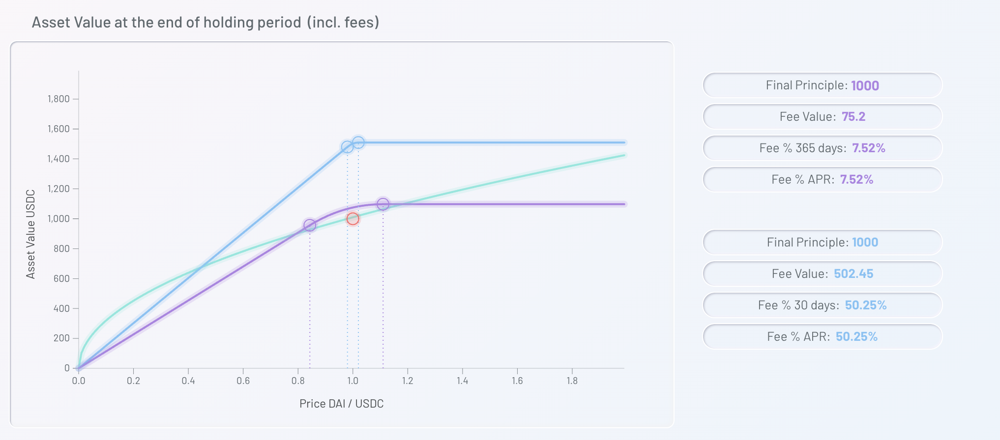

# YIN – The Solution to Liquidity in Decentralized Finance: Personal NFT Smart Vaults and Liquidity Pools

  As a result of the introduction of Active Liquidity by Uniswap v3, diligent Liquidity Provider (LP) looking to optimize fund utilization rate needs to update pricing continuously. For average users, in order to achieve high fund turnover and utilization, they could only rely on first-rate liquidity smart contracts. **YIN** was born against this backdrop of the DeFi space.

  YIN is a liquidity pool created under Uniswap v3, in which users could manage their funds liquidity through their personal NFT Smart Vaults and interact with periphery smart contracts.

  Users could choose to subscribe from various CHI that are available through their personal Smart Vaults. CHI are individual NFTs that each systematically describes an advanced yield farming strategy. Each CHI represents different combinations of strategies. When users supply liquidity to a CHI through subscribing vaults, the CHI places this liquidity into the corresponding strategies. These strategies in turn generate aggregate LP rewards, interest returns, as well as trading fees and any other gains, which are distributed into the subscribing vaults.

## Mechanism of YIN

  Profits from YIN smart contract will be distributed to stakers. In this sense, YIN is not only a DAO token, but also a multi-stake token.

  YIN smart contract seeks to find the best possible path for DeFi investment based on the hottest liquidity pools on Uniswap within specific time frames. Our quantitative strategy team tracks the current pricing as influenced by liquidity, and determines the liquidity utilization strategies accordingly.

  Users who are skilled developers could spend YIN to create their own CHI. The creator(s) collect a fee from the profit earning transactions from other users subscribing to the CHI. Thus, developers and contributors to the strategy can make some additional profits.

## Why do You Need YIN

  The above graph illustrates three strategies:
    
  1. The green line represents the yield curve for Uniswap v2. Due to Uniswap v2’s liquidity protocol, the curve provides fee value throughout the entire curve interval.

  2. The purple line represents the yield curve for a strategy under Uniswap v3, which applies to the price interval from 0.81 to 1.1.
    When the price falls into this interval, the blue curve always shows a higher yield than that of Uniswap v2.

  3. The blue line represents the yield curve for a strategy tailored for a more specific price interval under Uniswap v3.
    This customization leads to significantly higher yield when the price falls into this interval. However, it would also mean stagnant growth or decline of staker’s funds once the price goes outside of the specific price interval.

  It is difficult for users to adapt quickly to the changes in price intervals under the current Uniswap v3 liquidity protocol. In addition, it is near impossible for average users to determine the suitable price intervals for specific strategies.

  This is where YIN comes in. Through effective price tracking and dynamic adjustment of liquidity according to price interval changes, YIN maximizes yield for users in liquidity staking.

## YANG: Your Personal NFT Smart Vault

  Prior to managing your liquidity assets, you would need to create your own YANG NFT smart vault. All subsequent asset management actions and processes will be performed from your YANG smart vault, thus retaining custody of assets, and effectively ensuring funds security.

## CHI: Programmable Liquidity Smart Contracts

  We would create each liquidity smart contract as a CHI, which is an NFT following the ERC-721 Standard. Managing funds in your Yang smart vault through the use of CHI provides the following benefits:

  1. Liquidity management is achieved by interactions between NFTs, the isolation levels of the NFTs ensure the security of funds.
  
  2. Programmable CHI allows for agile adaptation of different LP price intervals, which in turn maximizes yield for users.

  3. With customized CHI, provides the potential for simultaneous liquidity mining on multiple protocols with simultaneous rewards.

  4. Users with their own farming strategies could form these strategies into CHI, from which the contributors to the strategies could share a portion of the profits made by the vaults subscribing to the CHI.
